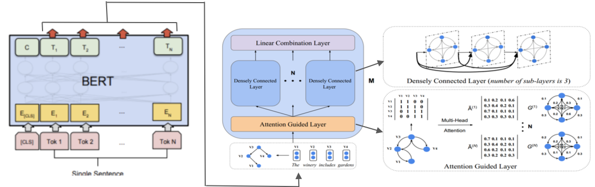

Attention Guided Graph Convolutional Networks over pretrained BERT Embeddings for Relation Extraction
==========

This code introduces the Attention Guided Graph Convolutional graph convolutional networks (Bert-AGGCNs) over pretrained BERT Embeddings relation extraction task (i2b2/VA 2010).

See below for an overview of the model architecture:



  

## Requirements

Our model was trained on GPU Tesla K80 of Google Colab.  

- Python 3 (tested on 3.6.8)

- PyTorch (tested on 0.4.1)

- CUDA (tested on 9.0)

- pytorch-pretrained-bert

- unzip, tar, wget (for downloading only)


## Preparation


  

First, download and untar pretrained bert model:

```
chmod +x download.sh; ./download.sh
```

  

Then prepare vocabulary and initial word vectors with:

```
python3 prepare_vocab.py
```

  

This will write vocabulary and word vectors as a numpy matrix into the dir `dataset/SUB_FOLDER/vocab`.

  

## Training

  

To train the Bert-AGGCN model on treatment-problem, run:

```
bash train_bert_aggcn_trp.sh 1
```

  

Model checkpoints and logs will be saved to `./saved_models/01`.


To train the Bert-AGGCN model on test-problem, run:

```
bash train_bert_aggcn_tep.sh 2
```

  

Model checkpoints and logs will be saved to `./saved_models/02`.


To train the Bert-AGGCN model on problem-problem, run:

```
bash train_bert_aggcn_pip.sh 3
```

  

Model checkpoints and logs will be saved to `./saved_models/03`.
  

For details on the use of other parameters, please refer to `train.py`.

  

## Evaluation

  

Our pretrained treatment-problem model is saved under the dir saved_models/01. To run evaluation on the test set, run:

```
bash eval_bert_aggcn_trp.sh
```

  

This will use the `best_model.pt` file by default. Use `--model checkpoint_epoch_10.pt` to specify a model checkpoint file.


Similarly, our pretrained test-problem model is saved under the dir saved_models/02. To run evaluation on the test set, run:

```
bash eval_bert_aggcn_tep.sh
```

  

Also, our pretrained problem-problem model is saved under the dir saved_models/03. To run evaluation on the test set, run:

```
bash eval_bert_aggcn_pip.sh
```
